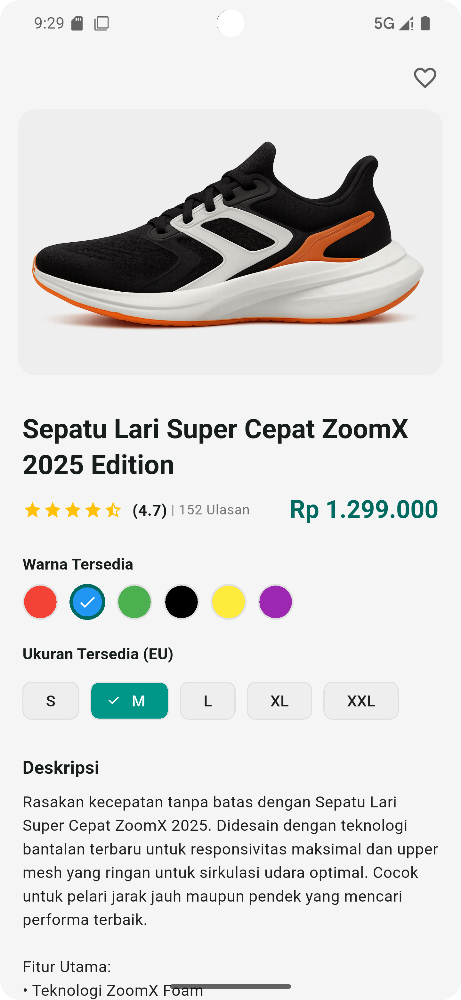

# Layout Halaman Produk

Project ini menampilkan layout halaman produk sederhana mengenai **layouting** di Fluter. Tujuan dari project ini adalah untuk menunjukan UI untuk halaman detail produk yang responsif.

## Screenshot Aplikasi

## Cara menjalankan aplikasi di Android Studio

1. Open project
2. Pada toolbar kanan, pilih Device Manager --> pilih emulator --> start emulator
3. Pada toolbar atas, pilih device yang akan digunakan
4. Klik tombol run, atau bisa gunakan shortcut Shift + F10